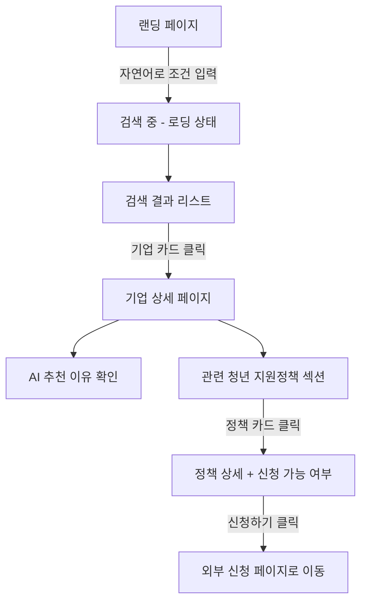
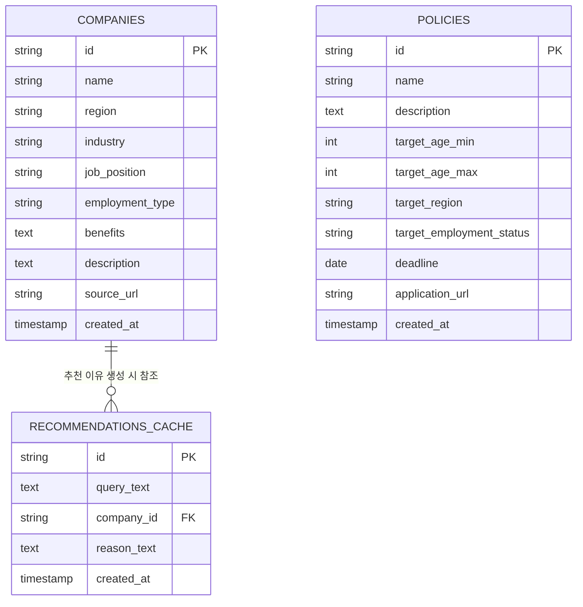
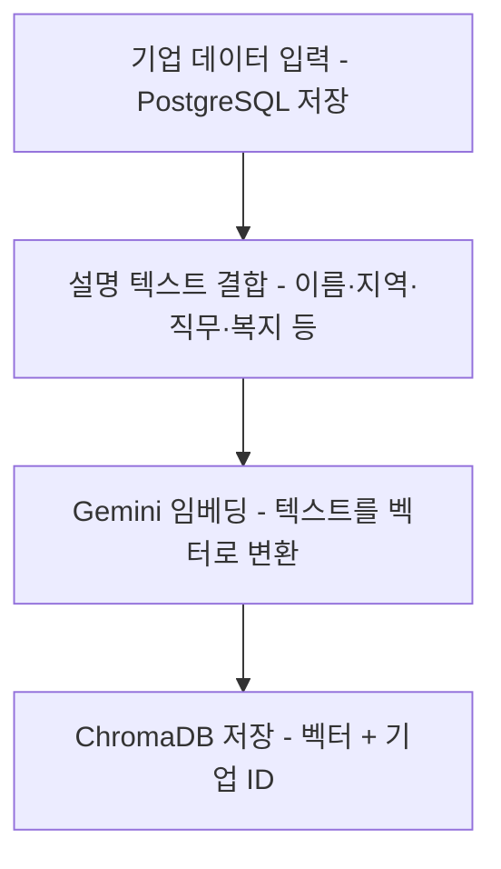
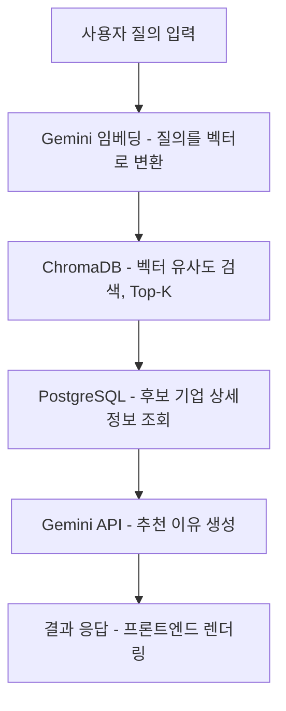

# PRD (Product Requirements Document)
## 잡아드림 (Job-a-Dream)

**작성일**: 2026-07-04
**해커톤 진행**: 09:00 ~ 15:00 (개발 09:00~14:00, 발표 준비 14:00~15:00, 발표 5분·PPT 데모)
**팀 구성**: 5명 (전공자 3명, 비전공자 2명)

---

## 1. 프로젝트 개요

### 1.1 서비스명
**잡아드림 (Job-a-Dream)**

### 1.2 한 줄 소개
AI 기반 맞춤형 기업 추천과 청년 지원정책 정보를 하나로 연결해주는 취업 준비생 통합 플랫폼

### 1.3 배경 및 문제 정의
현재 취업 준비생들은 기업 정보와 정부의 청년 지원정책이 파편화되어 있어, 매번 여러 사이트를 오가며 정보를 직접 찾고 비교해야 하는 불편을 겪고 있다. 기존 채용 플랫폼은 단순 키워드 검색과 기업 나열 방식에 머물러 있어 "왜 이 기업이 나에게 적합한지"에 대한 구체적인 근거를 제공하지 못한다. 또한 지역 우수기업 노출과 지원 사업 연계도 부족해, 구직자가 효율적이고 합리적인 의사결정을 내리기 어려운 상황이다.

**핵심 문제 요약**
- 기업 정보 ↔ 청년 지원정책 정보의 파편화
- 키워드 매칭 수준에 그치는 추천 (근거 부재)
- 지역 우수기업 및 지원사업 연계 부족

---

## 2. 타겟 사용자

| 구분 | 설명 |
|---|---|
| 연령대 | 20~30대 |
| 페르소나 1 | 취업 준비생 (구직 활동 중인 일반 청년) |
| 페르소나 2 | 신입 개발자 (기술 스택 기반 기업 매칭 필요) |
| 페르소나 3 | 지역기업 취업 희망자 (지역 우수기업 정보 접근성 낮음) |
| 페르소나 4 | 정부 지원 사업을 잘 모르는 청년 (정책 정보 접근성 낮음) |

---

## 3. 핵심 가치 제안 (차별점)

| 기존 서비스 | 잡아드림 |
|---|---|
| 키워드 기반 검색 | **자연어(텍스트) 기반 검색** |
| 단순 기업 나열 | **AI 추천 + 구체적 추천 이유 제시** |
| 정보 파편화 (기업/정책 분리) | **기업 정보 + 청년 지원정책 통합 제공** |
| 정적 정보 제공 | **RAG 기반 검색으로 최신·정확한 정보 반영** |
| 지원 가능 여부 확인 어려움 | **정책 신청 링크까지 원스톱 연결** |

---

## 4. 핵심 기능 및 우선순위 (개발 가능 시간: 5시간)

전체 10개 기능 후보를 "서비스 정체성 증명 → 완성도 → 편의 기능 → 재미 요소" 순으로 4단계로 분류했습니다.

### P0 — 필수 (데모의 핵심 스토리, 반드시 완성)
| 기능 | 설명 |
|---|---|
| 기업 검색 | 자연어 질의 입력 처리 (예: "지방에서 일할 수 있는 신입 백엔드 개발자 채용 기업") |
| AI 맞춤 기업 추천 | 사용자 조건에 맞는 기업 리스트 산출 |
| 추천 이유 생성 | RAG 기반으로 왜 이 기업이 적합한지 근거 텍스트 생성 |
| 기업 상세 페이지 | 검색 결과를 확인하는 기본 화면 |
| 청년 지원정책 추천 | 기업 정보와 함께 관련 정책을 노출 (핵심 차별점) |

> 이 5개가 없으면 "잡아드림"의 핵심 가치(자연어 추천 + 근거 + 정책 통합)를 증명할 수 없습니다. 5시간 중 최소 60~70%를 여기에 투입하는 것을 권장합니다.

### P1 — 중요 (시간이 허락하면 반드시 포함)
| 기능 | 설명 | 포함 이유 |
|---|---|---|
| 신청 링크 연결 | 정책 상세에서 실제 신청 페이지로 바로 연결 | 구현 비용이 낮고, "정보 확인→행동"까지 이어지는 완결성을 보여줌 |
| 반응형 웹 | 데스크톱/모바일 대응 | Tailwind + shadcn/ui 사용 시 추가 비용이 크지 않음 |

### P2 — 여유 기능 (시간이 남을 때만)
| 기능 | 설명 | 보류 이유 |
|---|---|---|
| 즐겨찾기 | 관심 기업/정책 저장 | 핵심 스토리와 무관, UX 편의 기능 |
| 최근 검색 기록 | 검색 히스토리 표시 | 핵심 스토리와 무관 |
| 기업 비교 | 2~3개 기업 비교 뷰 | UI 복잡도 대비 데모 임팩트가 상대적으로 낮음 |

### P3 — 재미 요소 (P0~P2가 모두 끝나고 정말 시간이 남을 때만)
| 기능 | 설명 | 비고 |
|---|---|---|
| 떠다니는 키워드 버블 | 검색창 위나 옆에 "대구", "신입", "원격근무" 같은 키워드가 거품처럼 둥둥 떠다니다가, 클릭하면 "잡혀서" 검색 조건으로 선택되는 인터랙션 | "잡아드림"(잡다+드림) 컨셉과 맞닿는 재미 요소. 기존 자연어 텍스트 검색은 그대로 유지하고, 그 위에 보조 입력 수단으로 얹는 정도로 제한할 것 — 핵심 검색 로직은 건드리지 않음 |

> P2와 P3의 차이: P2는 "시간 남으면 넣으면 좋은 기능"이고, P3는 "핵심 동작과 무관한 순수 디자인·재미 요소"입니다. P3는 P0가 완전히 안정화되고 P1·P2까지 여유가 있을 때만 시도하고, 5시간 중 단 1분도 P0보다 먼저 쓰지 않는 것을 권장합니다.

---

## 5. 기술 스택

| 영역 | 기술 |
|---|---|
| Frontend | Next.js (App Router), TypeScript, Tailwind CSS, shadcn/ui, Lucide React |
| Backend | Next.js Route Handlers, TypeScript |
| Database | PostgreSQL |
| AI (텍스트 생성) | Gemini API — 자연어 질의 이해, 추천 이유 생성 |
| 임베딩 (벡터 검색) | Gemini API 임베딩 모델 — 카드 등록 없는 무료 티어 |
| Vector Database | ChromaDB (MVP) → 향후 PostgreSQL + pgvector로 확장 고려 |
| Deployment | Vercel |

> **AI 제공사 확정 (수정)**: 대회 규정상 비용 지출이 불가능해, **Gemini API 하나로 생성+임베딩을 모두 처리**하는 것으로 변경합니다 (기존 Claude API + Voyage AI 조합에서 전환). Gemini는 카드 등록 없이 쓸 수 있는 무료 티어가 있어 과금 위험 자체가 없습니다. API 키도 하나만 있으면 되어 구조가 더 단순해집니다.

### ⚠️ 반드시 확인해야 할 것 (Gemini 무료 티어 관련)

1. **무료 티어 요청 한도는 API 키가 아니라 프로젝트(계정) 전체 기준입니다**
   5명이 같은 Gemini API 키를 공유해서 테스트하면, 각자 따로 한도를 받는 게 아니라 **팀 전체가 하나의 분당 요청 한도(대략 분당 10~15건 수준, 모델별로 다름)를 나눠 씁니다.** 여러 명이 동시에 몰아서 테스트하면 금방 한도에 걸릴 수 있으니, 테스트 시간을 겹치지 않게 조율하거나 `recommendations_cache`를 적극 활용해 같은 질의를 반복 호출하지 않도록 할 것.
2. **무료 티어는 카드 등록이 없는 대신, 입력 데이터가 모델 개선에 활용될 수 있습니다**
   이번 프로젝트는 공개된 기업·정책 정보만 다루므로 민감 정보 문제는 없지만, 참고로 알아둘 것.
3. **정확한 무료 대상 모델명은 가입 시점에 Google AI Studio에서 직접 확인할 것**
   Gemini는 무료 티어 대상 모델과 요청 한도가 자주 바뀝니다. PRD 14.4에 권장 모델을 적어두었지만, 실제 개발 시작 전에 콘솔에서 "현재 무료 티어에 포함된 모델"을 다시 한번 확인할 것.

**참고**
- ChromaDB는 로컬/임베디드 실행이 쉬워 MVP 단계 RAG 구축에 적합하지만, Vercel 서버리스 환경에서는 영속성 이슈가 있을 수 있어 배포 전 짧게라도 테스트 권장
- 향후 서비스 확장 시 pgvector로 전환하면 별도 벡터 DB 없이 PostgreSQL 하나로 통합 관리 가능

---

## 6. UX Flow (사용자 흐름)

### 6.1 메인 플로우 (Happy Path)

> 위 코드 블록은 Mermaid 문법입니다. GitHub, Notion, VS Code(Markdown Preview Mermaid 확장) 등에서는 자동으로 그림으로 렌더링됩니다. 렌더링이 안 되는 뷰어라면 mermaid.live 에 붙여넣어 확인할 수 있습니다.

### 6.2 예외 플로우

| 상황 | 처리 | 비고 |
|---|---|---|
| 검색 결과 없음 | Empty State — "조건에 맞는 기업이 없어요. 조건을 조금 더 넓혀보세요" + 예시 질의 제안 | |
| AI 응답 실패/타임아웃 | Error State — "일시적으로 추천을 불러오지 못했어요. 다시 시도해주세요" + 재시도 버튼 | |
| 질의가 너무 모호함 (예: "좋은 회사 추천해줘") | 조건 없이도 인기/우수기업 기본 추천을 먼저 보여주고, "지역·직무를 알려주시면 더 정확해져요" 안내 | 데모 중 심사위원이 실제로 이런 질의를 입력할 가능성이 높아 대비 필요 |
| API 요청 한도 초과 (Rate Limit) | 직전 결과를 화면에 유지 + "잠시 후 다시 시도해주세요" 안내 | Gemini 무료 티어는 분당 요청 한도가 낮고 팀 전체가 하나의 한도를 공유하므로, **대비용 예시 결과(하드코딩 백업 데이터)를 미리 준비**해두는 것을 권장 |
| 정책 신청 마감/만료 | "마감" 배지 표시, 신청 버튼 비활성화 | |
| 외부 신청 링크 접속 불가 (사이트 개편 등) | 정책명 기반 대체 검색 링크(예: 정책명 + "지원") 제공 | |
| 정책 자격요건(연령·취업상태) 확인 불가 | 로그인이 없어 사용자 나이·취업상태를 자동으로 알 수 없음 → 정책 상세에 자격요건을 텍스트로 안내하고 사용자가 스스로 판단하도록 함 (배지로 자동 "불가" 표시하지 않음, 지역만 자동 매칭) | |

> 데모 리허설(13:30~14:00) 때 위 예외 상황을 실제로 한 번씩 발생시켜보고 화면이 자연스럽게 넘어가는지 확인하는 것을 권장합니다. 특히 "API 요청 한도 초과"는 발표 중 실제로 발생할 위험이 있어 사전 대비가 중요합니다.

---

## 7. UX 원칙 및 상태 처리

주신 12개 UX 항목을 5시간 개발 일정 기준으로 선별했습니다. 비전공자 팀원도 바로 이해할 수 있도록 쉬운 설명을 함께 담았습니다.

### 포함 (구현)
| 항목 | 쉬운 설명 | 포함 이유 |
|---|---|---|
| Responsive Design (반응형 디자인) | 화면 크기(PC·태블릿·모바일)에 맞춰 레이아웃이 자동으로 바뀌는 것 | 심사 기준(UX·디자인 20점)에 직접 반영, Tailwind로 비용 낮음 |
| Loading Skeleton (로딩 스켈레톤) | 데이터를 아직 못 불러왔을 때, 빈 화면 대신 회색 상자 모양으로 "곧 채워질 자리"를 미리 보여주는 화면 | AI 응답에 수 초 걸릴 수 있어, 멈춘 것처럼 보이지 않게 하는 최소 안전장치. shadcn/ui 기본 컴포넌트로 저비용 구현 |
| Search Debounce (검색 디바운스) | 타이핑을 멈춘 뒤 일정 시간(예: 0.3초)이 지나야 검색을 실제로 실행해서, 한 글자 칠 때마다 서버에 요청 보내는 걸 막는 기법 | 불필요한 API 호출 방지, 몇 줄로 구현 가능 |
| Toast (토스트) | 화면 한쪽에 잠깐 떴다가 사라지는 작은 알림 메시지 (예: "저장되었습니다") | API 실패·성공 피드백을 가볍게 전달, shadcn/ui 기본 제공 |
| Empty State (빈 상태 화면) | 검색 결과가 하나도 없을 때 보여주는 안내 화면 | 서비스가 "고장난 것"처럼 보이는 걸 방지 (데모 중 실제 발생 가능성 높음) |
| Error State (에러 상태 화면) | 오류가 발생했을 때 사용자에게 보여주는 안내 화면 | AI API 호출 실패 시 데모가 중단되지 않도록 하는 필수 안전장치 |

### 제외 (또는 대체)
| 항목 | 쉬운 설명 | 이유 |
|---|---|---|
| Mobile First (모바일 퍼스트) | 디자인할 때 모바일 화면을 기준으로 먼저 설계하고, 이후 PC 화면으로 넓혀가는 방식 | 발표가 노트북/화면으로 진행되는 라이브 데모라 데스크톱 우선 설계 + 반응형 대응으로 충분 |
| Autosuggest (자동완성 추천) | 검색창에 입력하는 동안 관련 검색어를 미리 보여주는 기능 (예: 유튜브 검색창) | 자연어 질의형 검색이라 키워드 자동완성의 실익이 낮음, 최근 검색 기록(P2)과 함께 보류 |
| Progressive Disclosure (점진적 정보 공개) | 처음엔 핵심 정보만 보여주고, "더보기"를 눌러야 상세 정보가 나오는 방식 | 화면 수가 적은 MVP 규모에서 실익 대비 구현 공수가 큼 |
| Accessibility (접근성) / Keyboard Navigation (키보드 탐색) | 접근성: 시각·청각 장애 등 누구나 사용할 수 있도록 배려하는 설계 / 키보드 탐색: 마우스 없이 키보드만으로 모든 기능을 쓸 수 있게 하는 것 | 별도 작업 대신 shadcn/ui 컴포넌트 자체의 기본 접근성·키보드 지원을 그대로 활용 (추가 공수 없이 기본 수준 확보) |
| Optimistic UI (낙관적 UI) | 서버 응답을 기다리지 않고 성공을 가정해 화면을 먼저 바꿔주는 기법 (예: 좋아요 버튼을 누르면 서버 응답 전에 즉시 하트가 채워짐) | 적용 대상인 즐겨찾기 자체가 P2로 보류되어 불필요 |

---

## 8. 디자인 시스템

### 8.1 컨셉 키워드
청년 · 신뢰감 · 미래지향 · 깔끔함 · 기업 친화적 · 친근한 AI

### 8.2 컬러 팔레트
| 역할 | 컬러 |
|---|---|
| Primary | Blue |
| Secondary | Sky Blue |
| Accent | Mint |
| Background | White |
| Success | Green |
| Warning | Orange |

### 8.3 타이포그래피 및 스타일 가이드
| 항목 | 값 |
|---|---|
| Typography | Pretendard |
| Radius | 20px |
| Shadow | Soft Shadow |
| Grid | 8pt Grid |
| Icon | Lucide React |

### 8.4 디자인 레퍼런스
Linear, Toss, Wanted, OpenAI, Perplexity
→ 공통적으로 여백을 넉넉히 쓰는 깔끔한 레이아웃, 부드러운 그림자와 라운드 처리, 신뢰감 있는 블루 계열이 특징. 잡아드림의 "신뢰감 있는 친근한 AI" 컨셉과 방향이 일치해 참고하기 좋습니다.

---

## 9. 팀 구성 및 역할 (제안 — 최종은 팀 논의로 확정)

| 역할 | 담당(예시) | 요약 |
|---|---|---|
| Backend/DB 리드 | 전공자 A | DB·API 구조 판단 |
| AI/RAG 리드 | 전공자 B | 검색·추천 파이프라인 구조 판단 |
| 프론트엔드 기능 구현 | 전원 (전공/비전공 무관) | 화면 단위로 배정 |
| 데이터 수집 | 비전공자 A | 완료 후 프론트엔드 합류 |
| 발표 준비 | 비전공자 B | 프론트엔드 병행 |

### 9.0 전공/비전공 구분 없이 기능 구현 (중요)
Claude Code를 쓰면 프로그래밍 경험이 적어도 화면 단위 기능은 직접 구현할 수 있습니다. 아래 역할 구분은 "이 사람만 이 일을 한다"가 아니라 **"이 사람이 해당 영역을 리드하고 최종 판단한다"**는 뜻으로 읽어주세요.

- DB 스키마 설계, AI/RAG 파이프라인처럼 **구조적 판단이 필요한 영역(9.1, 9.2)**은 전공자가 리드하는 것을 권장합니다 — 문제가 생겼을 때 전체 구조를 이해하고 있어야 빠르게 대응할 수 있어서입니다.
- 화면을 하나하나 만드는 **프론트엔드 기능 구현(9.3)**은 Claude Code로 충분히 가능해서, 전공/비전공 구분 없이 전원이 참여하는 것을 권장합니다.
- 비전공자 B는 처음부터, 비전공자 A는 데이터 수집이 끝나는 대로(대략 11:00 전후) 9.3에 합류합니다.

### 9.1 Backend/DB 리드 (전공자 A)
- [ ] PostgreSQL 스키마 생성 (`companies`, `policies`, `recommendations_cache` — 13번 ERD 참고)
- [ ] 시드 스크립트 작성 (데이터 담당자의 스프레드시트 → DB 일괄 삽입)
- [ ] 기업 검색 API (질의를 받아 AI/RAG 담당자의 검색 함수 호출 → 결과 반환)
- [ ] 기업 상세 조회 API
- [ ] 청년 지원정책 조회 API (기업 `region` 기준 매칭 — 13.2 참고)
- [ ] 신청 링크 연결 (P1)
- [ ] Vercel 배포 및 환경변수(API 키) 설정

### 9.2 AI/RAG 리드 (전공자 B)
- [ ] Gemini 임베딩 함수 작성 (문서 인덱싱용 / 질의용 호출 분리)
- [ ] ChromaDB 세팅 및 컬렉션 생성
- [ ] 기업 데이터 인덱싱 스크립트 (오프라인 준비 — 14.1 참고)
- [ ] 벡터 유사도 검색 함수 구현 (Top-K=5, 유사도 임계값은 실데이터로 테스트 후 결정 — 14.4 참고)
- [ ] Gemini API 프롬프트 설계 및 배치 호출 구현 (추천 이유 생성 — 14.4 참고)
- [ ] `recommendations_cache` 캐싱 로직 연결 (무료 티어 한도 절약에도 도움)
- [ ] API 한도 초과 대비 백업 데이터 준비 (6.2 참고)
- [ ] 팀원들과 Gemini API 테스트 시간대 겹치지 않게 조율 (한도가 프로젝트 전체 공유임을 공지)

### 9.3 프론트엔드 기능 구현 (전원 참여, 화면 단위 배정)
아래는 초기 배정 예시입니다. 11:00 전후로 비전공자 A가 합류하면 팀과 다시 조율하세요.

| 화면/기능 | 담당(예시) | 시작 시점 |
|---|---|---|
| 검색 페이지 (입력창, 디바운스) | 전공자 C | 09:30~ |
| 검색 결과 리스트 (카드, 로딩·빈·에러 상태 — 7번 참고) | 비전공자 B | 09:30~ |
| 기업 상세 페이지 (기업 정보 + 추천 이유 + 관련 정책 섹션) | 전공자 C | 11:00~ |
| 정책 상세 표시 (자격요건 텍스트 + 신청 링크 버튼) | 비전공자 A | 11:00~ (데이터 수집 완료 후) |
| 백엔드 API 연동 | 각자 본인 화면 담당자 | 계속 |
| 반응형 스타일링 점검 (PC/모바일) | 전원 각자 자기 화면 | 12:30~13:30 |

> 비전공자도 Claude Code로 직접 화면을 구현합니다. 구체적인 진행 방법은 `CLAUDE.md`의 "비전공자를 위한 Claude Code 활용 가이드"를 참고하세요.

### 9.4 데이터 수집 (비전공자 A, 09:00~11:00 집중)
- [ ] 기업 데이터 20~30개 수집 (13.3 가이드 형식대로 스프레드시트 작성)
- [ ] 정책 데이터 10~15개 수집
- [ ] `description` 필드 품질 검수 (검색 품질에 직접 영향 — 13.3 참고)
- [ ] AI 담당자와 함께 프롬프트 테스트 (실제 질의 몇 개 넣어보고 결과 확인)
- [ ] 데모용 대표 질의 3~5개 미리 준비 (11.2 데모 시나리오와 연결)
- [ ] **완료 후 9.3 프론트엔드 기능 구현에 합류**

### 9.5 발표 준비 + 프론트엔드 (비전공자 B)
- [ ] 9.3 프론트엔드 기능 구현 참여 (처음부터)
- [ ] shadcn/ui 컴포넌트 셋업 보조 (버튼, 카드, 스켈레톤, 토스트)
- [ ] 디자인 시스템 적용 확인 (8번 컬러·폰트·radius 등)
- [ ] PPT 발표자료 제작 (11번 심사 기준·데모 시나리오 반영, 13:00 이후 집중)
- [ ] 라이브 데모 백업용 화면 녹화 준비 (11.2 참고)
- [ ] 발표 리허설 진행

---

## 10. 5시간 개발 타임라인 (제안)

| 시간 | 내용 |
|---|---|
| 09:00–09:30 | 역할 최종 확정, 레포/환경 세팅, Gemini API 키 발급 확인 |
| 09:30–11:00 | P0 1차 개발: DB 스키마, 기업 검색 API, ChromaDB 임베딩 세팅 (Top-K·유사도 임계값 결정 포함, 14번 참고) |
| 11:00–12:30 | P0 완성: AI 추천 로직 + 추천 이유 생성, 청년 지원정책 연동 |
| 12:30–13:30 | P1 개발(신청 링크, 반응형) 및 프론트-백엔드 통합, UX 상태 처리(로딩/에러/빈 상태) |
| 13:30–14:00 | 버그 픽스, Vercel 배포, 데모 리허설 (예외 상황 포함) |
| 14:00–15:00 | 발표자료(PPT) 준비 및 발표 |

> 실제 진행 상황에 따라 유동적으로 조정하되, 12:30 시점에 P0가 미완성이면 P1은 과감히 포기하고 P0에 집중하는 것을 권장합니다.

---

## 11. 심사 기준 및 발표 전략

### 11.1 심사 기준
| 항목 | 배점 |
|---|---|
| 문제 정의 | 20 |
| 기술 구현 | 20 |
| AI 활용도 | 20 |
| UX·디자인 | 20 |
| 발표력 | 20 |
| **총계** | **100** |

### 11.2 데모 시나리오 (5분, PPT + 라이브 데모)
| 순서 | 내용 | 주요 배점 연결 |
|---|---|---|
| 1 | 문제 상황 제시 (파편화된 정보, 근거 없는 추천) | 문제 정의 |
| 2 | 자연어로 조건 입력 → 검색 실행 | AI 활용도 |
| 3 | 추천 결과 + 구체적 추천 이유 확인 | AI 활용도, 기술 구현 |
| 4 | 기업 상세 페이지에서 관련 청년 지원정책 확인 | 문제 정의(통합 가치), 기술 구현 |
| 5 | 정책 신청 링크 클릭까지 시연 | UX·디자인 (완결된 흐름) |
| 6 | 반응형 화면 짧게 보여주기 (여유 시) | UX·디자인 |
| 7 | 마무리 — 차별점 요약 및 확장 가능성 언급 | 발표력 |

> 5분은 매우 짧기 때문에, 각 화면 전환마다 "왜 이게 특별한지" 한 문장씩 짚어주는 것이 발표력 점수에 유리합니다. 라이브 데모가 불안정할 경우를 대비해 화면 녹화본을 PPT에 백업으로 넣어두는 것을 권장합니다.

### 11.3 성공 기준
- 자연어 질의에 대해 추천 이유가 포함된 결과가 정상 반환되는가
- 기업 정보와 지원정책이 하나의 흐름에서 연결되어 제공되는가
- 5분 안에 문제-해결-차별점이 명확히 전달되는가

---

## 12. 리스크 및 고려사항

- **시간 제약**: 실질 개발 시간이 5시간으로 매우 촉박함. P0 범위를 벗어나지 않는 것이 가장 중요.
- **Gemini 무료 티어 한도 공유**: 5번 섹션의 ⚠️ 항목 참고 — 팀 전체가 하나의 요청 한도를 공유하므로, 테스트 시간대를 조율하지 않으면 정작 필요할 때 한도에 걸릴 수 있음.
- **ChromaDB + Vercel 조합**: 서버리스 배포 환경에서 벡터 DB 영속성/콜드스타트 이슈가 발생할 수 있음.
- **데이터 확보**: 실제 데이터 크롤링을 우선 시도하되, 지체되면 즉시 샘플 데이터셋으로 전환.
- **팀 역량 배분**: 비전공자 2명이 데이터 정리·UI 조립·발표 준비에 기여할 수 있도록 역할을 명확히 배정.

---

## 13. 데이터베이스 스키마 (ERD)

P0/P1 범위(기업 검색, 추천, 청년 지원정책, 신청 링크)를 기준으로 설계한 최소 스키마입니다. 백엔드/AI 담당자가 동시에 작업을 시작할 수 있도록, 개발 시작 전에 이 구조로 먼저 합의하는 것을 권장합니다.

### 13.1 테이블 설명
| 테이블 | 역할 |
|---|---|
| `companies` | 기업 정보. 기업 상세 페이지와 검색 결과 카드에 사용. `id`는 ChromaDB에 저장하는 벡터 문서 ID와 동일하게 맞춰서, 벡터 검색 결과 → 상세 정보 조회를 바로 연결합니다. |
| `policies` | 청년 지원정책 정보. `target_region`/`target_age_min`/`target_age_max`/`target_employment_status`로 기업의 지역·상황과 매칭해 관련 정책을 필터링합니다. |
| `recommendations_cache` | 같은 질의·기업 조합에 대해 이미 생성한 AI 추천 이유를 저장해두는 캐시 테이블. API 재호출을 줄여 비용과 속도를 아끼고, 6.2 예외 플로우의 "API 요청 한도 초과" 상황에서 백업 데이터로도 활용할 수 있습니다. |

### 13.2 설계 노트
- **`id`는 자동 생성(uuid/serial)이 아니라 사람이 직접 정하는 고정 문자열입니다** (예: `c1`, `c2`... / `p1`, `p2`...). 이유는 13.4 참고 — DB가 자동으로 채번하면 팀원마다 값이 달라질 수 있어, 데이터 준비 단계에서 미리 고정해둡니다.
- **`companies` ↔ `policies`는 고정 FK로 연결하지 않습니다.** 정책은 검색/추천 시점에 기업의 `region`과 정책의 `target_region`을 비교해 자동으로 매칭합니다. `target_age_min`/`target_age_max`/`target_employment_status`는 **로그인 없이는 자동으로 판정할 수 없으므로, 정책 상세 화면에 "자격요건" 정보로 그대로 노출하고 사용자가 스스로 확인하도록 합니다** (자동 필터링 대상 아님). 기업마다 정책을 미리 연결해두는 조인 테이블을 만들 필요가 없어 5시간 일정에 더 적합합니다.
- **인증/사용자 테이블은 만들지 않습니다.** 즐겨찾기·최근 검색 기록은 P2로 보류된 기능이라 로그인 개념 자체가 필요 없습니다.
- **P2 기능이 나중에 추가된다면** `user_favorites`(user_id, company_id), `search_logs`(query_text, created_at) 정도의 테이블이 필요합니다. 지금은 스키마에 포함하지 않고, 시간이 남을 때만 추가하는 것을 권장합니다.

### 13.3 데이터 준비 가이드 (담당: 비전공자 A)
- **목표 수량**: 기업 20~30개, 정책 10~15개 정도면 데모에는 충분합니다. 너무 많이 모으려다 시간을 다 쓰지 않도록 주의하세요.
- **수집 형식**: 구글시트/엑셀에 아래 컬럼 그대로 정리 → 백엔드 담당자가 시드 스크립트로 PostgreSQL에, AI 담당자가 인덱싱 스크립트로 ChromaDB에 각각 넣습니다.
- **companies 필수 컬럼**: `id`(예: `c1`, `c2`, `c3`..., 직접 순서대로 지정), `name`, `region`, `industry`, `job_position`, `employment_type`, `benefits`, `description`, `source_url`
- **policies 필수 컬럼**: `id`(예: `p1`, `p2`...), `name`, `description`, `target_age_min`, `target_age_max`, `target_region`, `target_employment_status`, `deadline`, `application_url`
- **`id`는 한 번 정하면 절대 바꾸지 마세요.** 이 값이 PostgreSQL과 ChromaDB를 이어주는 유일한 연결고리입니다 (13.4 참고).
- **`description`은 검색 품질에 직접 영향을 줍니다.** 최소 2~3문장으로 구체적으로 작성해주세요. (예: "대구 소재 IT 스타트업으로 신입 백엔드 개발자를 채용 중이며 원격근무와 4대보험을 지원합니다")

### 13.4 ChromaDB 로컬 동기화 (중요 — 5명이 각자 개발할 때 반드시 챙길 것)
PostgreSQL은 팀 공용 클라우드 DB를 하나 공유하지만(CLAUDE.md 참고), **ChromaDB는 MVP 특성상 로컬/임베디드로 실행됩니다.** 즉 팀원 각자의 노트북에 각자의 ChromaDB가 따로 존재합니다. 이대로 두면 "내 컴퓨터에서는 검색이 되는데 다른 사람 컴퓨터에서는 안 되는" 상황이 발생합니다.

**해결 방법**: AI/RAG 담당이 `data/companies.csv`(비전공자 A가 채운 시트를 내보낸 파일)를 읽어서 ChromaDB에 임베딩을 채워 넣는 **인덱싱 스크립트**를 만들어 `scripts/`에 커밋해둡니다. 팀원은 아래 시점에 이 스크립트를 각자 로컬에서 실행해서 본인의 ChromaDB를 채웁니다.
- 데이터가 처음 준비됐을 때 (약 11:00)
- `data/companies.csv`가 갱신되어 `git pull`로 새로 받았을 때

**이게 가능한 이유**: 13.3에서 `id`를 사람이 고정해뒀기 때문에, 누가 언제 이 스크립트를 실행하든 항상 같은 `id`로 같은 벡터가 만들어집니다. 그래서 PostgreSQL(공용, 실시간 공유)과 ChromaDB(로컬, 각자 재생성)가 서로 다른 위치에 있어도 `id` 기준으로 정확히 연결됩니다. 만약 `id`가 자동 생성(uuid 등)이었다면, 사람마다 실행할 때마다 값이 달라져서 이 연결이 깨졌을 것입니다.

---

## 14. AI 검색 파이프라인

기업 검색부터 추천 이유 생성까지 이어지는 전체 흐름입니다. 백엔드/AI 담당자가 개발 시작 전에 이 흐름을 기준으로 작업을 나누는 것을 권장합니다.

### 14.1 사전 준비 단계 (오프라인, 배포 전 한 번)

### 14.2 실시간 검색 단계 (사용자 질의마다)

### 14.3 컴포넌트별 역할
| 시스템 | 역할 | 하지 않는 일 |
|---|---|---|
| PostgreSQL | 기업·정책의 구조화된 사실 저장·조회 | 의미 기반 검색, AI 판단 |
| Gemini (임베딩) | 텍스트 ↔ 벡터 변환(임베딩)만 담당 | 검색, 판단, 텍스트 생성 |
| ChromaDB | 벡터끼리 가까운 것 찾기(유사도 검색)만 담당 | 왜 적합한지 이유 설명 |
| Gemini (생성) | 좁혀진 후보를 보고 이유를 생성 | 전체 DB를 직접 탐색 |

Gemini가 매번 전체 기업 목록을 보는 게 아니라, ChromaDB가 먼저 후보를 좁혀준 결과만 보고 이유를 생성하는 구조입니다. 기업 수가 늘어도 빠르고 비용이 적게 듭니다 (이번 프로젝트는 무료 티어 안에서 해결).

### 14.4 개발 전 반드시 정해야 할 값
| 항목 | 권장값 | 비고 |
|---|---|---|
| Top-K (검색 결과 개수) | 5개 | 화면에 보여줄 카드 개수와 일치시킬 것 |
| 유사도 임계값 (threshold) | 실제 데이터로 테스트 후 결정 | **중요**: 벡터 검색은 키워드 검색과 달리 "결과 0개"가 자연 발생하지 않고 항상 "가장 가까운 것"을 반환합니다. 임계값을 정하지 않으면 6.2번의 "검색 결과 없음" Empty State가 절대 나타나지 않습니다 — 유사도가 임계값 미만이면 빈 상태로 처리하도록 반드시 구현할 것 |
| Gemini 추천 이유 생성 방식 | 배치 처리 (한 번의 호출로 Top-K 전체 처리) | 기업별로 API를 5번 나눠 부르지 않고, Top-K 기업 정보를 프롬프트 하나에 모두 넣어 한 번에 응답받을 것 (무료 티어 한도 절약에 특히 중요) |
| Gemini의 역할 범위 | 이유 생성만, 재정렬/필터링 안 함 | 벡터 검색 결과 순서를 그대로 유지하고 이유만 붙이는 단순한 동작으로 시작. 시간 남으면 상위 3개만 골라 설명하도록 확장 가능 |
| 임베딩 대상 텍스트 | DB에 별도 저장 안 함 | name+region+industry+job_position+benefits+description을 인덱싱 시점에 조합해서 임베딩. 별도 컬럼 불필요 |
| 텍스트 생성 모델 | Flash 계열 우선 (예: Gemini 2.5/3 Flash 중 무료 티어 대상) | 추천 이유 생성은 비교적 단순한 작업이라 가볍고 빠른 모델로 충분. **정확한 모델명은 개발 시작 전 Google AI Studio에서 현재 무료 티어 대상 확인 필수** (수시로 바뀜) |
| 임베딩 모델 | Gemini 임베딩 모델 (무료 티어 대상 확인) | 위와 동일하게 콘솔에서 최신 모델명 확인 후 확정 |

